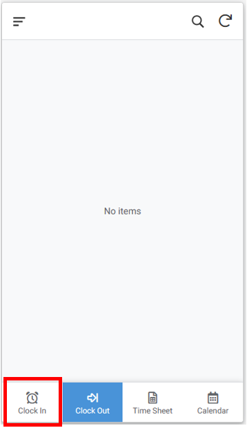
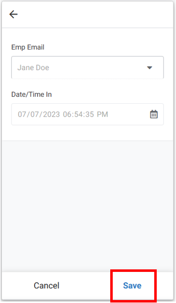
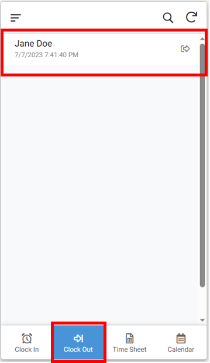

# KC Medical Care - Timesheet App

## Steps to record the time you have worked

1.	Tap on menu button “Clock In” at the bottom of the screen.  Highlighted by the Red box (see screenshot 1 below)
2.	And then tap on “Save” button.  Highlighted by the Red box (see screenshot 2 below)
3.	When you want to stop recording the time, tap on “Clock Out” at the bottom of the screen.  Highlighted by the Red box (see screenshot 3 below)
4.	And then tap on your name at the top of the screen.  Highlighted by the Red box (see screenshot 3 below).  On doing this, the app will stop recording time and will calculate the duration you have worked.

__Step 1 – Clock In (Screenshot 1)__

__Step 2 – Clock In Save (Screenshot 2)__

__Step 3 – Clock Out (Screenshot 3)__

## Steps to take photos of Documents

1.  Tap on the menu button "Images" at the bottom of the screen.  Highlighted by the Red box (see screen shot 4 below)

2.  And then tap on the "+" button.  Highlighted by the Red box (see screen shot 5 below)

3.  On the form that opens, click on the camera icon.  Highlighted by the Red box (see screen shot 6 below)

4.  Take the picture of the document
5.  
