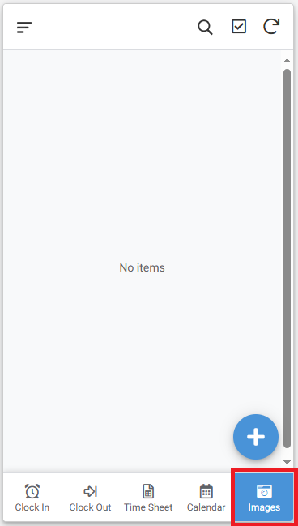
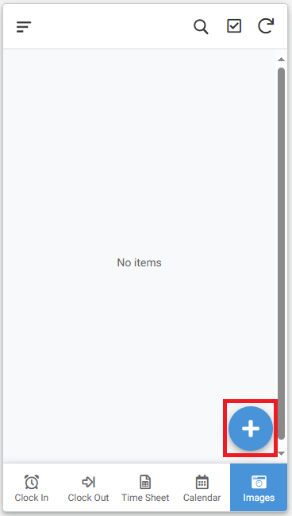
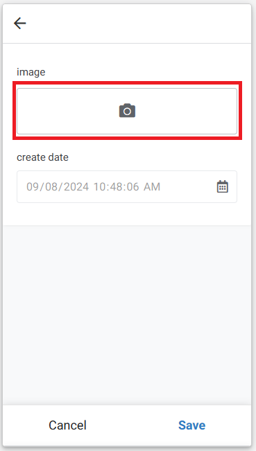
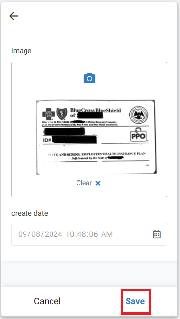
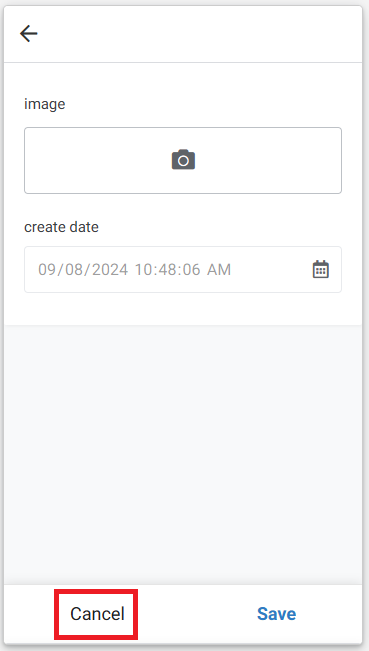

# KC Medical Care - Timesheet App

## Steps to record the time you have worked

1.	Tap on menu button “Clock In” at the bottom of the screen highlighted by the Red box (see screenshot below)

2.	And then tap on “Save” button highlighted by the Red box (see screenshot below)

3.	When you want to stop recording the time, tap on “Clock Out” at the bottom of the screen highlighted by the Red box and then tap on your name at the top of the screen highlighted by the Red box (see screenshot below).  On doing this, the app will stop recording time and will calculate the duration you have worked. (see screenshot below)

## Steps to take photos of Documents

1.  Tap on the menu button "Images" at the bottom of the screen highlighted by the Red box (see screenshot below)

2.  And then tap on the "+" button highlighted by the Red box (see screenshot below)

3.  On the form that opens, tap on the camera icon highlighted by the Red box (see screenshot below)

4.  Take the picture of the document.  After you have taken the picture, you will be brought back to the screen below.  Tap on "Save" button highlighted by the Red box (see screenshot below)

5.  After you have saved the picture, you will be brought back to screen where you will have the option to either take another picture by tapping on camera icon or tap on the "Cancel" button to stop taking pictures.

